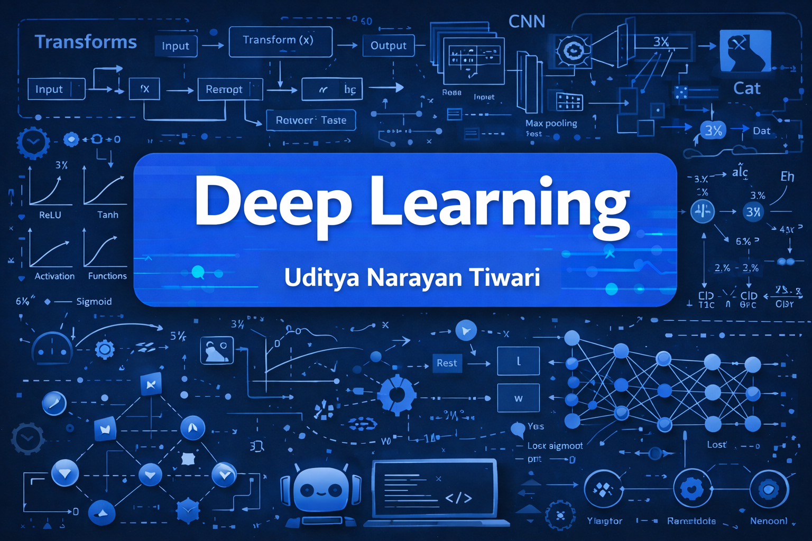

# Deep Learning for Beginner 🎯🧠

Welcome to the **Deep Learning for Beginner** repository!  
This project is designed to help newcomers understand the foundational concepts and practical implementations of deep learning using Python, TensorFlow, and Keras.


> 🚀 Whether you're starting your journey into AI or brushing up on core concepts, this repo gives you a clear, beginner-friendly introduction to deep learning.


---

## 📚 What You'll Learn

- Understanding neural networks & deep learning fundamentals
- Using TensorFlow & Keras for building models
- Working with real-world datasets (like MNIST, Fashion MNIST)
- Data preprocessing & normalization
- Model training, evaluation & tuning
- Visualizing metrics (accuracy, loss)

---

## 🧰 Tools & Libraries

- Python 3.x
- TensorFlow & Keras
- NumPy
- Pandas
- Matplotlib / Seaborn
- Jupyter Notebook

---

## 📁 Project Structure


📦 Deep-Learning-for-Beginner

├── beginner\_ann.ipynb          # Simple Artificial Neural Network example

├── cnn\_mnist.ipynb             # CNN applied on MNIST dataset

├── fashion\_mnist\_ann.ipynb     # ANN on Fashion MNIST dataset

├── README.md                   # Project documentation


---

## 🚦 How to Run

1. Clone the repository:

   ```bash
   git clone https://github.com/udityamerit/Deep-Learning-for-Beginner.git
   cd Deep-Learning-for-Beginner


2. Install the dependencies:

   ```bash
   pip install -r requirements.txt
   ```

3. Launch the notebooks:

   ```bash
   jupyter notebook
   ```

---

## 📊 Model Highlights

* **ANN on Fashion MNIST**

  * Input: 784 features (28x28 images)
  * Activation: ReLU (hidden), Softmax (output)
  * Optimizer: Adam
  * Accuracy: \~89%

* **CNN on MNIST**

  * Convolutional layers + MaxPooling + Dense layers
  * High accuracy with minimal overfitting

---

## 💡 Ideal For

* Students and beginners exploring AI/ML
* Practicing deep learning workflows
* Visual learners who benefit from Jupyter Notebooks

---

## 🔗 Useful Links

* [TensorFlow Docs](https://www.tensorflow.org/)
* [Keras Guides](https://keras.io/guides/)
* [MNIST Dataset](http://yann.lecun.com/exdb/mnist/)

---

## 📬 Connect with Me

**Uditya Narayan Tiwari**
B.Tech in CSE (AI & ML) | VIT Bhopal University
🌐 [Portfolio](https://udityanarayantiwari.netlify.app)
💼 [LinkedIn](https://www.linkedin.com/in/uditya-narayan-tiwari-562332289/)
💻 [GitHub](https://github.com/udityamerit)

---

## 📌 License

This project is open source and available under the [MIT License](LICENSE).

---

## 🌟 Show Your Support

If you like this project, don’t forget to give it a ⭐ and share it with others!

